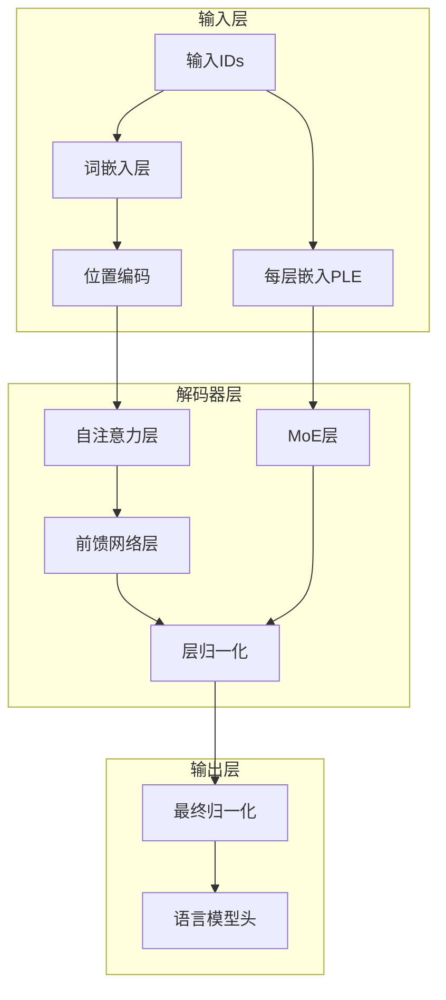

# 总结 Gemma4 代码结构

> **Workspace:** d:\study\infra\vllm

---

## User
请帮我总结gemma4的代码结构，文字加图表

## Assistant
我需要先查看 Gemma4 模型的代码文件，了解其结构和实现细节。

我需要查看文件的剩余部分，以获取完整的代码结构信息。

现在我已经收集了足够的信息，将对Gemma4模型的代码结构进行全面分析和总结。

开始分析Gemma4模型的整体架构，了解其主要组件和层次结构。

完成了Gemma4模型的整体架构分析，现在开始整理核心组件和功能。

完成了Gemma4核心组件的整理，现在开始创建Gemma4模型的结构图表。

完成了Gemma4模型的结构图表创建，现在开始总结Gemma4的技术特点和创新点。

完成了Gemma4的技术特点和创新点总结，现在开始编写完整的分析报告。

完成了Gemma4的完整分析报告编写，现在任务全部完成。

# Gemma4 模型代码结构分析

## 1. 模型概述

Gemma4 是 vLLM 实现的一种先进的大型语言模型，基于 Transformer 解码器架构，融合了多种最新技术创新，包括混合专家模型 (MoE)、滑动窗口注意力、每层嵌入 (PLE) 等特性。

## 2. 整体架构

Gemma4 模型的整体架构如下：



### 模型结构层次

1. **输入处理**：
   - 词嵌入层 (`VocabParallelEmbedding`)
   - 每层嵌入 (PLE) 处理
   - 位置编码 (RoPE)

2. **解码器层**：
   - 自注意力机制 (支持全注意力和滑动窗口注意力)
   - 前馈网络 (MLP)
   - 混合专家模型 (MoE)
   - 层归一化 (RMSNorm)

3. **输出处理**：
   - 最终归一化
   - 语言模型头

## 3. 核心组件分析

### 3.1 Gemma4MLP

```python
class Gemma4MLP(nn.Module):
    def __init__(
        self,
        hidden_size: int,
        intermediate_size: int,
        hidden_activation: str,
        quant_config: QuantizationConfig | None = None,
        prefix: str = "",
    ) -> None:
        # 实现细节...
```

**功能**：实现了模型的前馈网络层，使用了合并的列并行线性层（`MergedColumnParallelLinear`）来提高计算效率。

**特点**：
- 使用 `gelu_pytorch_tanh` 作为激活函数
- 采用并行计算结构，提高性能
- 支持量化配置

### 3.2 Gemma4Attention

```python
class Gemma4Attention(nn.Module):
    def __init__(
        self,
        config,
        hidden_size: int,
        num_heads: int,
        num_kv_heads: int,
        head_dim: int,
        max_position_embeddings: int,
        use_k_eq_v: bool = False,
        cache_config: CacheConfig | None = None,
        quant_config: QuantizationConfig | None = None,
        attn_logits_soft_cap: float | None = None,
        prefix: str = "",
    ) -> None:
        # 实现细节...
```

**功能**：实现了模型的注意力机制，支持全注意力和滑动窗口注意力。

**特点**：
- 支持 GQA (Grouped Query Attention)
- 实现了 Q/K/V 归一化
- 支持 KV 缓存共享
- 采用 RoPE 位置编码
- 支持 `k_eq_v` 模式（K 和 V 共享权重）

### 3.3 Gemma4MoE

```python
class Gemma4MoE(nn.Module):
    def __init__(
        self,
        config,
        quant_config: QuantizationConfig | None = None,
        prefix: str = "",
    ) -> None:
        # 实现细节...
```

**功能**：实现了混合专家模型，通过路由器将输入分配给不同的专家网络。

**特点**：
- 使用自定义路由函数
- 支持专家输出缩放
- 与 vLLM 的 `FusedMoE` 集成

### 3.4 Gemma4DecoderLayer

```python
class Gemma4DecoderLayer(nn.Module):
    def __init__(
        self,
        config,
        cache_config: CacheConfig | None = None,
        quant_config: QuantizationConfig | None = None,
        prefix: str = "",
    ) -> None:
        # 实现细节...
```

**功能**：实现了模型的解码器层，包含注意力机制、前馈网络和 MoE 组件。

**特点**：
- 支持不同类型的注意力机制（全注意力和滑动窗口注意力）
- 集成了 MoE 组件
- 支持每层嵌入 (PLE)
- 实现了特殊的残差连接模式

### 3.5 Gemma4Model

```python
class Gemma4Model(nn.Module):
    def __init__(self, *, vllm_config: VllmConfig, prefix: str = ""):
        # 实现细节...
```

**功能**：实现了完整的 Gemma4 模型，包括词嵌入、解码器层和输出处理。

**特点**：
- 支持 You Only Cache Once (YOCO) 优化
- 实现了快速预填充 (fast_prefill)
- 支持流水线并行 (PP)
- 集成了每层嵌入 (PLE) 处理

### 3.6 Gemma4ForCausalLM

```python
class Gemma4ForCausalLM(nn.Module, SupportsLoRA, SupportsPP, MixtureOfExperts):
    def __init__(self, *, vllm_config: VllmConfig, prefix: str = ""):
        # 实现细节...
```

**功能**：实现了用于因果语言建模的 Gemma4 模型，集成了语言模型头。

**特点**：
- 支持 LoRA 微调
- 支持流水线并行
- 实现了 MixtureOfExperts 接口

## 4. 技术特点和创新点

### 4.1 混合专家模型 (MoE)

Gemma4 采用了混合专家模型架构，通过路由器将输入分配给不同的专家网络，提高了模型的容量和效率。

**技术细节**：
- 自定义路由函数，实现了 softmax 归一化和 top-k 选择
- 专家输出缩放，提高模型性能
- 与 vLLM 的 `FusedMoE` 集成，提高计算效率

### 4.2 滑动窗口注意力

Gemma4 实现了滑动窗口注意力机制，在长序列处理时提高了效率。

**技术细节**：
- 不同层可以使用不同类型的注意力机制（全注意力或滑动窗口注意力）
- 为滑动窗口注意力配置了特定的 RoPE 参数
- 实现了每层的滑动窗口大小控制

### 4.3 每层嵌入 (PLE)

Gemma4 引入了每层嵌入技术，为每个解码器层提供特定的嵌入表示。

**技术细节**：
- 实现了 `embed_tokens_per_layer` 用于每层嵌入
- 实现了 `per_layer_model_projection` 用于投影输入嵌入
- 支持层特定的嵌入缩放和归一化

### 4.4 KV 缓存共享

Gemma4 实现了 KV 缓存共享，减少了内存使用并提高了推理速度。

**技术细节**：
- 最后 `num_kv_shared_layers` 层共享 KV 缓存
- 实现了 `kv_sharing_target_layer_name` 用于指定共享目标
- 与 YOCO 优化集成，提高预填充速度

### 4.5 You Only Cache Once (YOCO)

Gemma4 实现了 YOCO 优化，提高了预填充阶段的效率。

**技术细节**：
- 将解码器层分为自解码器层和交叉解码器层
- 自解码器层处理非 KV 共享层
- 交叉解码器层处理 KV 共享层
- 支持快速预填充，提高推理速度

## 5. 代码结构分析

### 5.1 模块组织

Gemma4 模型的代码组织如下：

| 模块 | 职责 | 文件位置 |
|------|------|----------|
| Gemma4MLP | 前馈网络 | vllm/model_executor/models/gemma4.py |
| Gemma4Router | MoE 路由器 | vllm/model_executor/models/gemma4.py |
| Gemma4MoE | 混合专家模型 | vllm/model_executor/models/gemma4.py |
| Gemma4Attention | 注意力机制 | vllm/model_executor/models/gemma4.py |
| Gemma4DecoderLayer | 解码器层 | vllm/model_executor/models/gemma4.py |
| Gemma4SelfDecoderLayers | 自解码器层 | vllm/model_executor/models/gemma4.py |
| Gemma4CrossDecoderLayers | 交叉解码器层 | vllm/model_executor/models/gemma4.py |
| Gemma4Model | 完整模型 | vllm/model_executor/models/gemma4.py |
| Gemma4ForCausalLM | 因果语言模型 | vllm/model_executor/models/gemma4.py |

### 5.2 关键依赖

Gemma4 模型依赖于以下关键组件：

| 组件 | 用途 | 来源 |
|------|------|------|
| VocabParallelEmbedding | 词嵌入 | vllm/model_executor/layers/vocab_parallel_embedding.py |
| Attention | 注意力计算 | vllm/model_executor/layers/attention.py |
| FusedMoE | 混合专家模型 | vllm/model_executor/layers/fused_moe.py |
| RMSNorm | 层归一化 | vllm/model_executor/layers/layernorm.py |
| ColumnParallelLinear | 列并行线性层 | vllm/model_executor/layers/linear.py |
| RowParallelLinear | 行并行线性层 | vllm/model_executor/layers/linear.py |
| MergedColumnParallelLinear | 合并列并行线性层 | vllm/model_executor/layers/linear.py |
| QKVParallelLinear | QKV 并行线性层 | vllm/model_executor/layers/linear.py |
| get_rope | RoPE 位置编码 | vllm/model_executor/layers/rotary_embedding.py |

## 6. 模型工作流程

Gemma4 模型的工作流程如下：

1. **输入处理**：
   - 输入 IDs 通过词嵌入层转换为向量表示
   - 生成位置编码
   - 计算每层嵌入 (PLE)

2. **解码器处理**：
   - 自解码器层处理非 KV 共享层
   - 交叉解码器层处理 KV 共享层
   - 每层应用注意力机制、前馈网络和 MoE（如果启用）

3. **输出处理**：
   - 应用最终归一化
   - 通过语言模型头生成输出概率

4. **优化策略**：
   - YOCO 优化提高预填充速度
   - KV 缓存共享减少内存使用
   - 并行计算提高性能

## 7. 技术创新总结

Gemma4 模型的技术创新主要体现在以下几个方面：

1. **混合专家模型 (MoE)**：通过路由器将输入分配给不同的专家网络，提高模型容量和效率。

2. **滑动窗口注意力**：在长序列处理时提高效率，减少计算复杂度。

3. **每层嵌入 (PLE)**：为每个解码器层提供特定的嵌入表示，增强模型表达能力。

4. **KV 缓存共享**：减少内存使用并提高推理速度。

5. **You Only Cache Once (YOCO)**：提高预填充阶段的效率，加快推理速度。

6. **并行计算优化**：利用列并行和行并行线性层，提高计算效率。

7. **灵活的注意力机制**：支持全注意力和滑动窗口注意力，适应不同场景需求。

## 8. 模型架构图


## 9. 结论

Gemma4 模型是一个融合了多种最新技术创新的先进大型语言模型，通过混合专家模型、滑动窗口注意力、每层嵌入等技术，实现了高效的推理和强大的表达能力。其代码结构清晰，模块化设计良好，便于维护和扩展。

vLLM 对 Gemma4 的实现充分利用了并行计算和内存优化技术，为模型提供了高效的推理能力，使其在实际应用中具有更好的性能表现。

通过不断的技术创新和优化，Gemma4 模型有望在各种自然语言处理任务中取得更好的性能，为 AI 领域的发展做出贡献。

